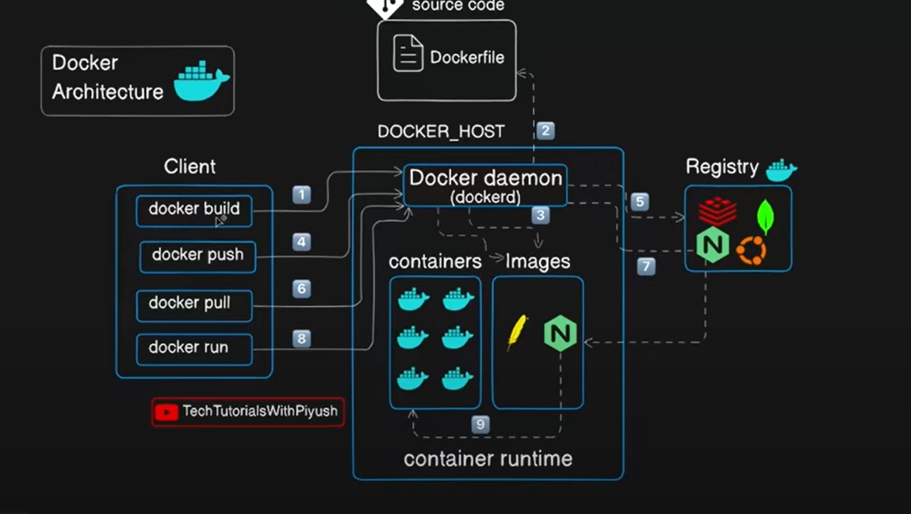

## Docker Fundamentals 

**why docker?**  
Earlier when you promoted your dev environment to production environment, there were some issues like misconfiguration and missing dependencies.\
Docker provides -
- Isolated environment - Libraries, application, runtime and dependencies.
- Lightweight sandbox environment
- Everything that is required to run the application.

**Podman** - Redhat product for containers.

## Docker Architecture

### Key Components of Docker Architecture

**1. Docker Client:** The interface where users interact with Docker (docker CLI or Docker API). \
**2. Docker Daemon (dockerd):** The background service that manages Docker containers, images, and networks. \
**3. Docker Engine:** It includes Docker Daemon, REST api, and CLI. \
**4. Docker Images:** Read-only templates containing application code, dependencies, and OS layers. They are stored in Docker Hub (public) or private registries. \
**5. Docker Container:** Lightweight, portable runtime environments created from images. Run in isolated environments on the host system. \
**6. Docker Registry:** A storage system for Docker images (e.g., Docker Hub, AWS ECR). \
**7. Docker Compose:** A tool for defining and running multi-container applications using a YAML file.

