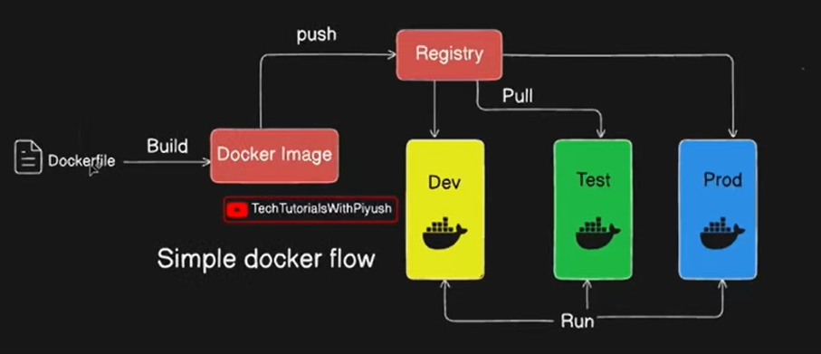

*Install Docker or use Play-with-docker on the browser* \
*Login/Create an account on Docker and Docker Hub*

## Simple Docker Flow



**Step-1** \
Clone the repository - 
```bash
git clone https://github.com/docker/getting-started-app.git
```

**Step-2** \
Create Dockerfile inside the getting-started-app
```bash
cd ./getting-started-app 
vi /Dockerfile
```

**Step-3** \
To enter the insert mode for writing into the file, **press i** \
The enter the following text into the file 
```
FROM node:18-alpine

WORKDIR /app

COPY . .

RUN yarn install --production

CMD ["node", "src/index.js"]

EXPOSE 3000
```

### *Explanation of Dockerfile*

> FROM node:18-alpine 

Here we are specifying the base image.

> WORKDIR /app

Here we are specifying our working directory inside the docker container. Think of it like entering 'cd /app' inside the container.

> COPY . .

Here we are copying the source code into the container. COPY [ source address on local ] [ destination address on work directory in container ]

> RUN yarn install --production

The RUN command executes commands at build time to modify the image and its effect is stored in the image's filesystem.\
It is typically used to install packages, set up dependencies, or perform configuration steps.\
The yarn install --production command installs only the dependencies (that are required in production) and not the dev-dependencies.

> CMD ["node", "src/index.js"]

The CMD command is used to execute commands at container runtime, meaning that they will run every time we run the image. \
It is used when you want to specify the default command that runs the image, etc.

> EXPOSE 3000

The EXPOSE command tells that the container is expected to listen on port 3000. \
However it does not publist the port/make it accessible to outside the container by itself. \
It serves as metadata for documentation purpose only. \
exposes a particular port with a specified protocol inside a Docker Container. In the simplest terms, the EXPOSE instruction tells Docker to get all the information required during the runtime from a specified port.

**Step-4** \
Exit and Save the Dockerfile - Press **esc** key and then type **:wq**.

**Step-5** \
To Create docker image of the project, run the following command inside the *getting-started-app* directory
```bash
docker build -t day2-todo .
```
On successful creation of an image, you can check it on Docker desktop or using the *docker images* command.

> docker build

Instructs Docker to build an image.

> -t day2-todo

Tags the image with the name day2-todo (-t stands for "tag").

> .

Specifies the build context, meaning Docker will look for the Dockerfile in the current directory (.).


### *How does Docker Build the image?*
Docker builds an image using a layered filesystem, where each command in a Dockerfile creates a new layer on top of the previous one. \
These layers are cached to speed up builds and optimize storage.

- Each instruction in a Dockerfile creates a new layer
- Layers are cached
- Each layer is read-only, except the last one

**Step-6** \
Create a remote repository on Docker Hub
- Visit *hub.docker.com*
- Create a new repository, lets call it test-repo

**Step-7** \
Login to docker and enter your username and password.

```bash
docker login
```

**Step-8** \
To push the image, we first need to tag the local image.
```bash
docker tag day2-todo:latest mycodejorunal/new-repo:latest
```

> docker tag

This tells docker to tag a local image

> day2-todo:latest

This is the existing local image

> mycodejorunal/new-repo:latest

mycodejorunal is the name of the my docker hub account. \
new-repo is the name for remote repo image. \
latest is the default tag when no tag is specified.

**Step-9** \
Now we can push the image

```bash
docker push codejorunal/test-repo:latest
```
> docker push 

This tells docker to push the image

> codejournal/test-repo:latest

This is name and tag of the image.

**Step-10** \
Now we can pull the image in any of the environment - dev/test/prod

```bash
docker pull mycodejorunal/test-repo:latest
```

**Step-11** \
Run a Docker container from an image named mycodejorunal/test-repo:latest.

> docker run -dp 3000:3000 mycodejorunal/test-repo:latest

Creates and runs a new container from an image.

**Step-12** \
To check if the container is running, run following command -
```bash
docker ps   
```
This will also show the name of container and container id assigned by docker. 

**Step-13** \
Follwing command will let you enter the container and you will see the working directory of the container in the shell prompt.

```bash
docker exec -it container_id/container_name bash
```

> docker exec

This command allows users to tun commands inside a running Docker container, bridging the gap between the container environment and the host system.
